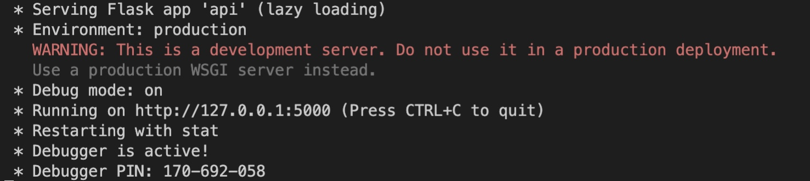

## API

This is an exercise on API implementation as part of the Secure Software Development course of the CS PgCert at the University of Essex Online. 

## Questions

### Question 1
Run the API.py code. Take a screenshot of the terminal output. What command did you use to compile and run the code?


#### Answer:

the command to run the code was ```python api.py```



### Question 2
Run the following command at the terminal prompt: w3m http://127.0.0.1:5000/user/Ann

What happens when this command is run, and why?

#### Answer:

A json file is downloaded, because an API end point is contacted through the http GET request

### Question 3
Run the following command at the terminal prompt: w3m http://127.0.0.1:5000/user/Adam

What happens when this command is run, and why?

#### Answer:

I received not found message because the is no "Adam" in the list of users.

### Question 4
What capability is achieved by the flask library?

Flash library provides web development microframework. Also, in this example, it provided API implementation functionality.

#### Answer 4:

### Architecture Evolution Activity
Based on your reading this week, could you write a section that might be appended to this paper, Salah et al, 2016, which would present the next phase of evolution history, from microservices to the technologies which are commonly in use today?

Please refer to this [link](https://drmohammadatieh.github.io/SSD/discussions.html#ArchitectureEvolution) to read the response.


